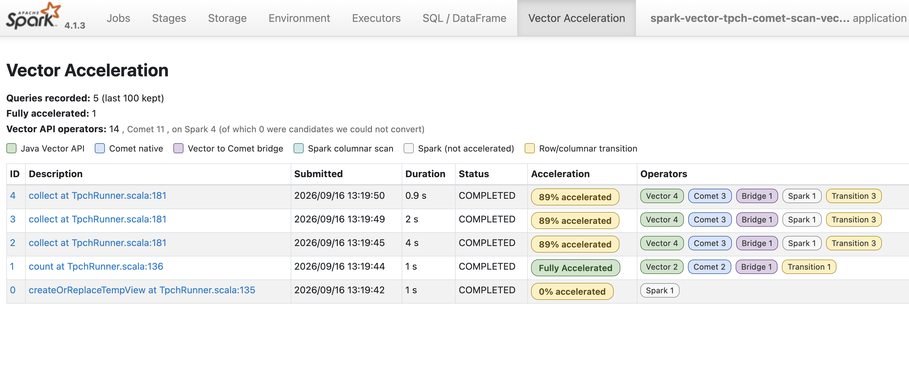
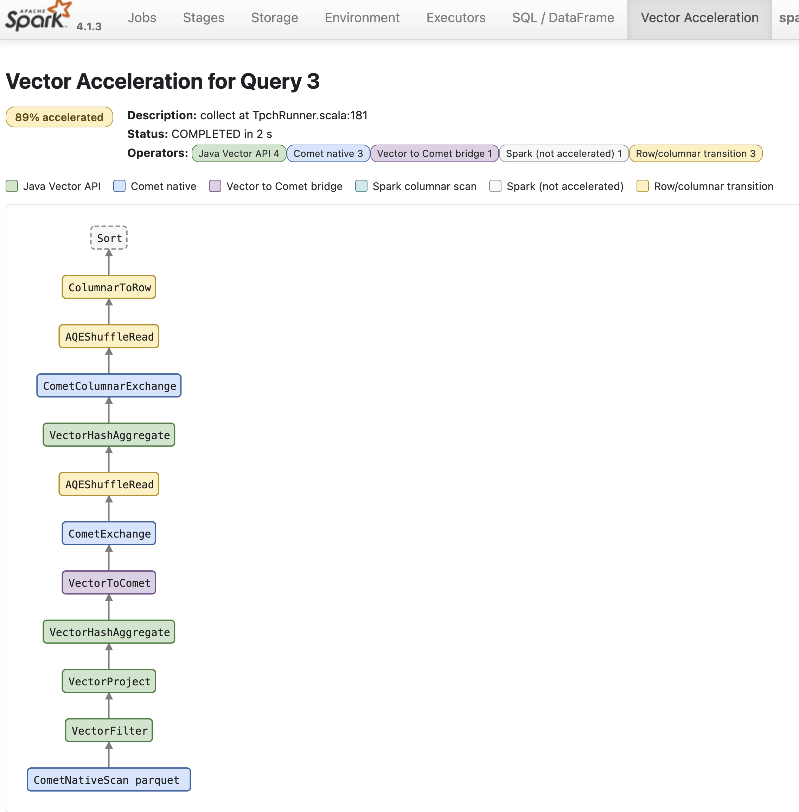

# spark-vector

A Spark SQL plugin that executes Filter, Project, HashAggregate (all four modes), Sort and
hash joins on Arrow-layout batches with the Java Vector API (`jdk.incubator.vector`). It follows the
architecture of [Apache DataFusion Comet](https://github.com/apache/datafusion-comet), but stays
entirely on the JVM: no native library, no JNI, no serialization boundary. Unsupported operators,
expressions or types fall back to Spark with a recorded reason. With Comet installed it can sit
between Comet's native Parquet scan and Comet's native shuffle, both reached zero copy.

- Spark 4.1.x, Scala 2.13, JDK 25 (the Vector API is still an incubator module)
- Input: Spark's vectorized Parquet reader (copied into Arrow layout once per batch, keeping
  dictionary-encoded strings as dictionary indices), Comet's native Parquet and Iceberg readers in
  scan-only mode (read zero-copy), or Iceberg's own JVM vectorized reader (read zero-copy, with
  merge-on-read deletes turned into a selection). See [docs/comet.md](docs/comet.md) and
  [docs/iceberg.md](docs/iceberg.md). Which operators convert, under what conditions and with
  which fallback reasons: [docs/operators.md](docs/operators.md); which expressions compile, on which
  types, and why the others fall back: [docs/expressions.md](docs/expressions.md); how the columnar
  shuffle moves Arrow batches between executors over Arrow Flight: [docs/flight-shuffle.md](docs/flight-shuffle.md).
- Output: unshaded Arrow 18.3.0 vectors (the version Spark bundles) wrapped in Spark's
  `ArrowColumnVector`, so Spark's own `ColumnarToRowExec` consumes them unchanged.

## Layout

| Module | Language | Contents |
|---|---|---|
| `kernels/` | Java 25 | `VectorBuffers` (Arrow-layout `MemorySegment`s), SIMD kernels: compare, bitmap logic, compaction, arithmetic, decimal rescaling and division, casts, reductions (plain and overflow-checked), group hashing and key table, grouped accumulators, sort, gather, column builder; scalar references used as test oracles |
| `spark/` | Scala 2.13 + Java | `VectorPlugin`, session extension, `VectorColumnarRule`, expression compiler, the operators (`VectorFilterExec`, `VectorProjectExec`, `VectorHashAggregateExec` with its spill, `VectorSortExec`, `VectorTakeOrderedAndProjectExec`, the limit family, `VectorUnionExec` / `VectorCoalesceExec`, `VectorExpandExec`, `VectorWindowExec`, `VectorGenerateExec`, `VectorSampleExec`, `VectorMergeRowsExec`, `VectorBroadcastHashJoinExec` / `VectorShuffledHashJoinExec` / `VectorBroadcastNestedLoopJoinExec` / `VectorSortMergeJoinExec`, `VectorShuffleExchangeExec`, `VectorToCometExec`), Arrow output, input adapters (Spark vectors, Arrow, Comet, Iceberg), the Vector Acceleration UI tab |
| `shuffle/` | Scala 2.13 | the columnar shuffle (#288): `VectorShuffleManager` (writer, reader, file cleanup), `PartitionedIpcWriter` / `PartitionedIpcFile` (Arrow IPC record batches per reduce partition in Spark's data-file layout, adaptive dictionaries, zstd), the Flight data plane (`FlightShuffle`: one server per executor, one `DoGet` per executor and reducer) and the `block` backend over Spark's block transfer |
| `benchmarks/` | Java + Scala | JMH kernel microbenchmarks; the TPC-H (22 queries) and TPC-DS (103 queries) runners, local and on a cluster; `submit-cluster.sh` and the Kubernetes `SparkApplication` manifest under `benchmarks/k8s/` (the image build and the run matrix of the EKS campaign arrive with #247); `profile-query.sh` (one query under JFR) |
| `spark-sql-tests/` | Scala 2.13 | Spark's own SQL golden-file suite run with the plugin (profile `spark-sql-tests`, on demand only; see below) |

## Building

```bash
export JAVA_HOME=/opt/homebrew/opt/openjdk@25      # any JDK 25
mvn verify                                          # kernels + Spark suites (Comet suites skipped)
mvn -Pcomet verify                                  # also runs the Comet-backed suites (see docs/comet.md)
mvn -Piceberg verify                                # also runs the Iceberg suites (see docs/iceberg.md)
mvn -Pcomet,iceberg verify                          # everything, including Comet's native Iceberg scan
```

The plugin jar is `spark/target/spark-vector-spark_2.13-<version>.jar` (kernels shaded in, nothing
else). Spark and Arrow are `provided`.

## Running with spark-submit

```bash
spark-submit \
  --conf spark.plugins=io.sparkvector.spark.VectorPlugin \
  --conf spark.driver.extraJavaOptions="--add-modules=jdk.incubator.vector --enable-native-access=ALL-UNNAMED" \
  --conf spark.executor.extraJavaOptions="--add-modules=jdk.incubator.vector --enable-native-access=ALL-UNNAMED" \
  --jars spark-vector-spark_2.13-0.1.0-SNAPSHOT.jar \
  ...
```

`spark.plugins` registers the session extension automatically; alternatively set
`spark.sql.extensions=io.sparkvector.spark.VectorSparkSessionExtensions`.

Configuration keys (all default to `true` except the last):

| Key | Meaning |
|---|---|
| `spark.vector.enabled` | main switch |
| `spark.vector.exec.filter.enabled` | convert `FilterExec` |
| `spark.vector.exec.mergeRows.enabled` | convert `MergeRowsExec`, the row-level operator of a `MERGE INTO` (#21), when the join below it is ours |
| `spark.vector.exec.project.enabled` | convert `ProjectExec` |
| `spark.vector.exec.aggregate.enabled` | convert `HashAggregateExec` |
| `spark.vector.exec.aggregate.final.enabled` | also convert Final-mode aggregates (their input is the shuffle) |
| `spark.vector.exec.sort.enabled` | convert `SortExec` over a columnar child (in memory, no spill; #380 designs the external sort) |
| `spark.vector.agg.spillThreshold` | hard cap on one grouped aggregate table (default `512m`; `0` = never spill). Below it the operator acquires its real footprint from Spark's task memory manager as the table grows and acts on a refusal: a partial aggregate emits its table and starts over, a final one spills into hash buckets and merges them one at a time (#363, #367) |
| `spark.vector.agg.spillBuckets` | buckets a final aggregate spills into (default `16`) |
| `spark.vector.agg.passThroughRatio` | a partial aggregate whose full table reduced its input by less than this factor stops aggregating and passes each batch on (default `1.5`, `0` = never; #376) |
| `spark.vector.sort.runRows` | rows per sorted run (default 1048576): the sort orders each run as the partition arrives and k-way merges the runs on output, bounding its scratch to the run (#285) |
| `spark.vector.exec.takeOrdered.enabled` | convert `TakeOrderedAndProjectExec` (`ORDER BY ... LIMIT`) over a columnar child; the per-partition top-N is columnar, the final merge of at most `limit` rows per partition goes through Spark's single-partition shuffle |
| `spark.vector.exec.limit.enabled` | convert `LocalLimitExec` / `GlobalLimitExec` / `CollectLimitExec` over a columnar child (no offset); batches pass through until the boundary, the collect limit's final take goes through Spark's single-partition shuffle |
| `spark.vector.exec.union.enabled` | convert `UnionExec` when at least one child is columnar (row children go through Spark's `RowToColumnarExec`); keep it on with Spark 4.1.3, whose own columnar union concatenates co-partitioned children it reports as partition-aligned |
| `spark.vector.exec.coalesce.enabled` | convert `CoalesceExec` over a columnar child (no shuffle, batches forwarded) |
| `spark.vector.exec.window.enabled` | convert `WindowExec` for `row_number`, `rank`, `dense_rank` and whole-partition aggregates over any child (a row sort below is converted by Spark's transitions) |
| `spark.vector.exec.generate.enabled` | convert `GenerateExec` with `explode`/`posexplode` (and the `_outer` forms) over an array column: the other columns gathered through a repeat index built from the array lengths, the elements copied once per array from Spark's array vector |
| `spark.vector.exec.sample.enabled` | convert `SampleExec` without replacement over a columnar child: Spark's own Bernoulli sequence per partition as a selection bitmap, so a seed returns Spark's rows |
| `spark.vector.exec.localTableScan.enabled` | convert `LocalTableScanExec` (`VALUES`, local relations) into one batch per partition; **off by default** -- nothing to accelerate, it only lets small-table tests run our operators |
| `spark.vector.exec.expand.enabled` | convert `ExpandExec` (`ROLLUP` / `CUBE` / `GROUPING SETS`, the `count(distinct)` rewrite) over a columnar child: one borrowed-column batch per grouping set, no data copy |
| `spark.vector.exec.broadcastHashJoin.enabled` | convert `BroadcastHashJoinExec` when the streamed side is columnar or an exchange (the build side stays Spark's broadcast) |
| `spark.vector.exec.broadcastNestedLoopJoin.enabled` | convert `BroadcastNestedLoopJoinExec` (non-equi joins) when the streamed side is columnar or an exchange; inner/cross, semi/anti/existence and outer joins with the streamed side preserved |
| `spark.vector.join.maxBuildSize` | build-side budget (bytes or a size string): the broadcast joins convert only for a relation estimated within it (they hold it in memory per task); the shuffled hash join holds its build side in memory up to it and past it splits both sides into buckets on disk (#416, the default of `spark.vector.join.spillBytes`); default 1 GiB, or `spark.memory.offHeap.size / spark.executor.cores` when off-heap is configured |
| `spark.vector.join.spillBytes` | the build bytes a shuffled hash join holds in memory before it splits (#416); default `256m` (measured at 1 TB: the same speed as 1 GiB on the join-heaviest queries, the planner sending what does not fit to the merge join); `0` never splits |
| `spark.vector.join.spillBuckets` | the buckets a split shuffled hash join writes each side into and joins one at a time (#416); default 32 |
| `spark.vector.join.hashMaxBuildSize` | the most a sort-merge join's build side may weigh per task, by statistics, for `mode=auto` to make it the hash join (#416): within `spark.vector.join.spillBytes` it builds in memory, within this cap it splits into buckets once, past it -- or without an estimate -- the merge join over the spilling sort takes it, its memory bounded whatever the inputs weigh; default `spillBuckets` x `spillBytes` (one bucketing pass), `0` removes the cap |
| `spark.vector.exec.shuffledHashJoin.enabled` | convert `ShuffledHashJoinExec` (both inputs are exchanges; Spark's row shuffle is converted below us) |
| `spark.vector.exec.sortMergeJoin.enabled` | compatibility alias: `false` reads as `spark.vector.exec.sortMergeJoin.mode=off`, `true` as `auto` (the default since #311). Kept for compatibility -- set the mode instead. The hash rewrite (#10): `SortMergeJoinExec` re-expressed as our shuffled hash join when the smaller side's statistics fit `spark.vector.join.maxBuildSize` and no parent relies on the merge's ordering; tie order under `ORDER BY` and the rows an unordered `LIMIT` picks can differ from Spark's order-preserving merge, which is why `auto` sends such joins to the merge join instead. Comet's equivalent replacement, `spark.comet.exec.forceShuffledHashJoin`, is also off by default (experimental); Comet executes the merge join natively (`spark.comet.exec.sortMergeJoin.enabled`, on by default), as `mode=merge` does here since #286. |
| `spark.vector.exec.sortMergeJoin.mode` | `auto` (default since #311; was `off`), `off`, `hash` (the rewrite above), `merge` (our order-preserving merge join over Spark's sorted inputs, #286 -- every join type, no statistics needed, Spark's row order kept) or `auto` (#287): per join, the merge join where a parent relies on the ordering, where the row order can reach a `LIMIT` or a sort without an exchange in between (the hash rewrite's tie order would show), or where the hash rewrite is not allowed -- no statistics, the build side past `spark.vector.join.hashMaxBuildSize` per task, a skew join -- and the hash rewrite where a side's statistics fit: in memory within `spark.vector.join.spillBytes`, in buckets on disk within the cap. The boolean flag reads as `auto`. The plan prints the decision on the join (`Sort-merge join as hash join: right side fits ...`). |
| `spark.vector.sort.spillBytes` | the sort's memory budget per task (#416): runs past it are written to local disk in sorted order and merged from there, which is what lets our merge join take inputs of any size; default 1 GiB (the join's build budget) -- the 32 MB of #451 came from a sweep that shared the cluster with a full run; measured alone in the full run's shape it cost the merge-join queries 30-50% (q14a 121.8 vs 93.7 s, q4 106.9 vs 71.2) because the spilled runs share the node disk with the shuffle files before them; `0` turns spilling off |
| `spark.vector.comet.shuffle.range.enabled` | also hand range-partitioned exchanges (global `ORDER BY`) to Comet's native shuffle |
| `spark.vector.comet.mixed.enabled` | `false`; with Comet on the classpath, a Spark operator left to Spark whose children are ours goes to Comet's native operator through the sink leaf (`docs/comet.md`, #280) -- for the operator kinds `spark.vector.comet.preferComet` names. |
| `spark.vector.comet.preferComet` | empty; the allowlist of the mixed pass (#281): comma-separated operator kinds (`filter`, `project`, `sort`, `sortMergeJoin`, `hashJoin`, `broadcastHashJoin`, `window`, `expand`, `union`, `limit`, or `all`), each optionally qualified (`project:wideDecimal`, `filter:strings`, `sort:estimatedRows>1000000`). A listed operator above one of our chains is offered to Comet first and ours steps aside with the reason `delegated to Comet (spark.vector.comet.preferComet)`; one Comet declines is ours after all, never Spark's. Empty = mixed plans allowed, none requested. An entry is added only when it meets the three-part rule of `docs/comet.md`, whose decision table (TPC-H SF10, #281) found none that does as written: the default stays empty; Comet's join (2-3.6x ours where it fires) and Comet's scan-side filter (-8% over TPC-H, the #14 dictionary decode) name the two costs to remove on our side first. |
| `spark.vector.exec.strictFloatingPoint` | **on by default**: double `sum`/`avg` round exactly like Spark (one accumulator per group, rows added in order). `false` uses lane-parallel and interleaved partial sums that differ from Spark's in the last bits (about 7% of aggregate kernel time, 2.5% of TPC-H Q1) and can make an equality between two double sums fail (TPC-H Q15 returns no rows). Comet's `spark.comet.exec.strictFloatingPoint` is the analogous switch with the opposite default (`false`) and mechanism (`true` makes Comet fall back to Spark for such operations; we compute the strict result in our kernels). The benchmark configurations run with `false`, matching Comet's default |
| `spark.vector.exec.selection.enabled` | pass selection bitmaps between our operators instead of compacting |
| `spark.vector.comet.shuffle.enabled` | feed Comet's native shuffle from our operators when Comet's shuffle is configured |
| `spark.vector.shuffle.enabled` | our own columnar shuffle exchange over Arrow IPC and Arrow Flight (#288). Default `true`, but it only takes effect with the `spark-vector-shuffle` jar on the classpath and `spark.shuffle.manager=org.apache.spark.sql.vector.shuffle.VectorShuffleManager` -- without those the exchange stays Spark's. TPC-H SF10: 0.59x the row shuffle over the 22 queries (`docs/results.md`) |
| `spark.vector.shuffle.backend` | how a reducer fetches a remote map output: `flight` (default; one Flight server per executor -- for executors that stay up for the job), `block` (Spark's block transfer), or the class name of a `VectorShuffleBackend` from another jar |
| `spark.vector.shuffle.compression` | body compression of the shuffle's record batches: `zstd` (default; native), `lz4` (Arrow's codec is pure Java and an order of magnitude slower) or `none` |
| `spark.vector.shuffle.batchRows`, `spark.vector.shuffle.batchBytes`, `spark.vector.shuffle.bufferBytes` | a map task holds each reduce partition's rows until `batchRows` (default `8192`) or `batchBytes` (default `1m`) and writes them as one record batch; `bufferBytes` (default `64m`) caps what one task holds across partitions |
| `spark.vector.shuffle.flushBytes` | serialised bytes a map task keeps in memory per reduce partition before spilling to a temporary file (default `1m`) |
| `spark.vector.shuffle.writer.memoryLimit` | the map task's Arrow allocator limit (default `1g`), the backstop behind `bufferBytes` |
| `spark.vector.shuffle.writer.dictionaryMaxRatio` | a string column is dictionary-encoded on the wire only when distinct values / rows in the record batch is at most this (default `0.5`, #356); `1` always encodes, `0` never |
| `spark.vector.shuffle.flight.bindHost`, `spark.vector.shuffle.flight.threads` | the Flight server's bind address (default: the executor's host name) and serving threads (default: the core count, at least 4) |
| `spark.vector.ui.enabled` | attach the Vector Acceleration tab to the Spark UI (default `true`) |
| `spark.vector.ui.retainedExecutions` | queries kept by that tab (default `100`) |
| `spark.vector.explainFallback.enabled` | log why each operator was left to Spark (default `false`) |

The Flight shuffle server is a new network endpoint on every executor. With `spark.authenticate` on it
requires Spark's shuffle secret as a bearer token on every call and refuses unauthenticated `DoGet`s (it
refuses to start at all when auth is on but no secret is available); without `spark.authenticate` it is
as open as Spark's own block transfer in that configuration. TLS for the Flight server is not wired yet:
with `spark.ssl.rpc.enabled` the server refuses to start rather than serve in the clear -- use
`spark.vector.shuffle.backend=block` there until it lands.

Both backends assume executors that stay up for the job: a lost executor loses its map outputs and
Spark recomputes them. Disposable executors need a push-based shuffle service such as Apache
Celeborn, which is future work, not part of #288 -- the `VectorShuffleBackend` seam (a commit hook
per map output, a `read` a service-backed backend overrides whole, a stream reader that decodes
several map outputs' streams concatenated) is where it plugs in.

JVM system properties for the kernels: `sparkvector.vectorBits=128|256|512` forces a vector shape
(the default is the platform's preferred one), `sparkvector.platform=neon|sve|avx2|avx512` overrides the
probed SIMD platform the kernels dispatch on (`docs/results.md`, "x86 kernel lab"), `sparkvector.agg.interleave=1|2|4` sets how many
accumulator copies the grouped aggregation rotates through when `spark.vector.exec.strictFloatingPoint`
is off (default 1 on AVX-512 and 4 elsewhere; strict mode always uses one, and an explicit 1 also means Spark's summation order), `sparkvector.selection.minFraction` (default 0.5) is the
surviving fraction below which a filter compacts instead of forwarding a selection, and
`sparkvector.agg.plainDictMaxEntries` (default 512) is the number of distinct values above which a
plain (non-dictionary) string group key stops being dictionary-encoded on the fly and is hashed and
compared per row instead.

### Memory tuning

Two pools matter, and they are not the same one Spark's defaults assume.

**Off-heap: the data.** Every batch our operators produce is Arrow memory from Netty's allocator,
and so are the shuffle's record batches and the Flight server's buffers. That allocator is bounded by
the JVM's direct-memory limit, which defaults to the heap size -- so an executor with a small heap and
a large `spark.executor.memoryOverhead` still refuses Arrow allocations at the heap's size unless
`-XX:MaxDirectMemorySize` is raised. Set it to the overhead less what the JVM itself needs (the
cluster manifests use the overhead minus 2 GB), and size the overhead for the data in flight: a task's
input batch, its output batch, the shuffle writer's `bufferBytes` (64 MB per task) and, on a reducer,
the fetched blocks of the partition it is merging.

**On-heap: the tables.** The grouped aggregate's key table and accumulators, and a hash join's build
table and its heap mirrors, are Java arrays on the heap. The aggregate registers with Spark's task
memory manager and asks for its real footprint as its table grows (#367), so it lives inside the
executor's execution memory: each task is entitled to roughly `spark.executor.memory x
spark.memory.fraction / cores`, more when its neighbours are idle. The join's build side is bounded by
`spark.vector.join.maxBuildSize` instead. Two rules of thumb follow. The heap
is not "just the JVM": with 13 tasks per executor and a 20 GB heap, an aggregate gets about 900 MB
before it has to spill, whatever the overhead holds. And the accumulators are interleaved for the
kernels (`sparkvector.agg.interleave`, 4 on NEON, 1 on AVX-512 and in strict mode), which multiplies
their footprint by the same factor -- strict mode is the cheapest in memory as well as the exact one.

| setting | what it bounds |
|---|---|
| `spark.executor.memory`, `spark.executor.memoryOverhead`, `-XX:MaxDirectMemorySize` | the tables (heap) and the data (direct); the 1 TB campaign ran 20 GB / 30 GB / 28 GB per 13-core executor |
| `spark.vector.agg.spillThreshold` | a hard cap on one grouped aggregate table (default `512m`). Below it the operator asks Spark's task memory manager for the table's real footprint as it grows and acts on a refusal: a partial aggregate emits its table and starts over, a final aggregate spills into hash buckets and merges them one at a time (#363, #367). `0` disables both |
| `spark.vector.agg.spillBuckets` | buckets a final aggregate spills into (default `16`); each is merged in memory, so the buckets, not the input, must fit |
| `spark.vector.agg.passThroughRatio` | a partial aggregate whose full table reduced its input by less than this factor stops aggregating and passes each batch on (default `1.5`, `0` = never; #376). The exchange receives the same rows either way |
| `spark.vector.join.maxBuildSize` | the largest build side the hash joins take (per task, on the heap) |
| `spark.vector.shuffle.bufferBytes`, `spark.vector.shuffle.flushBytes`, `spark.vector.shuffle.batchBytes` | what a map task holds before writing (direct memory): across all partitions, per partition before its temporary file, per record batch |
| `spark.sql.shuffle.partitions` | the size of a reduce task's input, hence of every table built from it: at 1 TB with 200 partitions a wide exchange hands a reducer several hundred MB of compressed input, and the final aggregate over it is the one that spills (#368 measures 1000 partitions with a 128 MB advisory size) |

The sort and the window hold their whole partition (Arrow memory, plus an `int` permutation per row on
the heap) and do not spill; a partition that cannot fit should keep Spark's sort
(`spark.vector.exec.sort.enabled=false`).

**Disk.** Everything we write lands under `spark.local.dir`, through Spark's own block manager, so it
is sized and cleaned like Spark's shuffle files -- and on Kubernetes that is the node's disk or the
`emptyDir` the manifest mounts, not the container's image layer.

| what | when | where | how big |
|---|---|---:|---|
| a final aggregate's spill | its table passes the budget: the whole table goes out as `spillBuckets` Arrow IPC streams, hash-partitioned by key; later merged one bucket at a time | a temp local block per bucket | the table's size; freed at the operator's close |
| a partial aggregate's overflow | never to disk -- it emits its table to the exchange and starts over | -- | -- |
| a map task's shuffle output | always: one data file per map task with a partition index (Spark's layout, our IPC record batches, `zstd` by default) | the shuffle block resolver's data file | the task's compressed output; deleted when the shuffle is unregistered (#358 -- before it, never) |
| a map task's overflow | a reduce partition's serialised bytes pass `spark.vector.shuffle.flushBytes` (1 MB) before the batch is closed | a temporary file beside the data file, merged into it at commit | at most the task's output |
| a reducer's fetched blocks | never to disk: one `DoGet` per remote executor streams its blocks back to back, decoded batch by batch, the previous batch freed as the next is produced | -- | a batch per open stream (one stream per remote executor), in direct memory; the `block` backend follows Spark's fetch rules |

Two numbers to keep in mind at scale. The node disk holds every live shuffle of the job -- at 1 TB with
eight executors the first run filled 20 GB nodes within minutes because map outputs were never deleted
(#358); with deletion in place the high-water mark is the largest stage's output. And an aggregate's
spill is written once and read once per bucket, so its cost is one extra pass of Arrow IPC over the
table, not a re-sort: q78's aggregate at 1 TB spilled and finished in 99 s against Spark's 114.
What went wrong at 1 TB and how each was fixed is in `docs/results.md`: map outputs never deleted
(#358, the node disks), an aggregate that never spilled (#363), a budget that undercounted the
accumulators four to eight times (#367), and a budget that then overcounted them and emptied tables
that fit (#376).

### JDK 25 and Spark 4.1

Spark 4.1 officially supports JDK 17 and 21. Running it on 25 needs two things beyond the usual
`--add-opens` set that Spark's launcher already passes:

- Hadoop 3.4.2, which Spark 4.1.3 bundles, calls `Subject.getSubject` and fails on JDK 24+
  ([HADOOP-19212](https://issues.apache.org/jira/browse/HADOOP-19212)). Replace
  `hadoop-client-api` and `hadoop-client-runtime` in `$SPARK_HOME/jars` with 3.4.3 (drop-in shaded
  jars; this project's tests do the same through Maven).
- `--sun-misc-unsafe-memory-access=allow` silences the deprecation warnings from Spark's and Arrow's
  use of `Unsafe`.

## How it works

```
Driver                                           Executor (per batch)
------                                           --------------------
FilterExec        -> VectorFilterExec            ColumnarBatch -> VectorBuffers (adapter)
ProjectExec       -> VectorProjectExec           kernels over MemorySegment (compare, arith, reduce)
HashAggregateExec -> VectorHashAggregateExec     Arrow vectors -> ArrowColumnVector -> next operator
(Partial and Final)                              or a selection bitmap over the child's columns
Sort, Window, Expand, Generate, Limit, Sample,   the same contract: columnar child in, Arrow out
Union, joins (hash, nested loop, sort-merge)     (see "Supported today")
ShuffleExchange   -> VectorShuffleExchange       Arrow IPC record batches per reduce partition ->
(spark-vector-shuffle jar)                       Spark's data file; reducers fetch over Arrow Flight
ShuffleExchange   -> CometShuffleExchange        Arrow C Data export -> CometVector (zero copy)
(with Comet)         over VectorToComet
```

`VectorColumnarRule` runs in Spark's `preColumnarTransitions`, bottom-up. An operator is converted
when its child is already columnar with supported types (a vectorized Parquet scan, a Comet scan, or
another spark-vector operator) and every expression compiles to the kernel IR. Otherwise the reason
is stored as a tree-node tag; `VectorFallback.reasons(plan)` lists them.

### The Vector Acceleration tab

`spark.plugins` also attaches a **Vector Acceleration** tab to the Spark UI (disable with
`spark.vector.ui.enabled=false`). It lists every SQL execution and how much of it was accelerated:



Per execution, it draws the final physical plan as a DAG with each operator coloured by the engine
that runs it. This is TPC-H Q1 over Comet's scan with Comet's shuffle between our Partial and Final
aggregates, taken before the columnar sort existed: the final `Sort` was the one operator left to
Spark, which is why the query shows 89% rather than the badge (with `VectorSortExec` it is fully
accelerated):



The colours:

| Colour | Engine | Counts as accelerated |
|---|---|---|
| green | our SIMD kernels (`VectorFilter`, `VectorProject`, `VectorHashAggregate`) | yes |
| blue | Comet's native operators (any class under `org.apache.spark.sql.comet` / `org.apache.comet`) | yes |
| purple | `VectorToComet`, the zero-copy hand-off to Comet's shuffle | yes |
| teal | a Spark scan that already emits batches, i.e. the vectorized Parquet reader | plumbing |
| grey, dashed | left to Spark | **no** |
| yellow | `ColumnarToRow` / `RowToColumnar`, the only nodes that convert between rows and batches | plumbing |
| light grey | `AQEShuffleRead` (adaptive execution's shuffle reader) and `ReusedExchange`/`ReusedSubquery`; they hand over whatever the exchange wrote, columnar when it is | plumbing |

A **Fully Accelerated** badge is shown when no operator is grey: every operator runs on the kernels
or on Comet, with only supported columnar sources and unavoidable row transitions around them. A
vectorized scan and a transition are plumbing rather than missed operators, so they do not block the
badge; a Spark exchange or sort does, because those are operators we do not implement (without
Comet's shuffle, any query with a stage boundary is therefore only partly accelerated).

Grey operators that the planner rule *tried* to convert are listed under "Why operators were not
accelerated" with the reason it recorded — the same information `spark.vector.explainFallback.enabled`
logs, and it reads as a cascade, since one uncompilable expression makes every operator above it
non-columnar:

```
Filter          unsupported expression RLike: lineitem.l_comment RLIKE 'special.*requests'
Project         child Filter is not columnar
HashAggregate   child Project is not columnar
```

One conversion the colours alone would hide: Comet's JVM shuffle (`CometColumnarExchange`, used when
its native writer is not) reads its child through `execute()`, so over one of our operators it turns
batches into rows and re-encodes them as Arrow. The node stays blue (it is Comet's), but its tooltip
says so. Comet's native shuffle (`CometExchange`), which the plugin selects for every partitioning
it can bridge, including range partitioning for global sorts, takes the batches directly.

Node classification comes from the operator's identity, not from a tag: a `VectorExec` is ours, a
class in Comet's packages is Comet's, and anything we declined to convert is the original Spark class
carrying the fallback tag. The tab prefers the final plan objects (captured from
`SparkListenerSQLExecutionEnd`) and falls back to matching node names on the listener event's
serialised plan for queries still running, which it labels *approximate*.

Between two of our operators a filter (or projection) does not compact: when at least half of the
rows survive it forwards the child's columns with a selection bitmap (`SelectedColumnarBatch`), and
the consumer folds the bitmap into its validity masks or group assignment. Inside a predicate,
`AND`/`OR` evaluate their right operand only where the left one leaves the row undecided, so the
compare kernels skip 64-row blocks with no live row and ANSI errors are only raised for rows Spark
would have evaluated too. Compaction happens once, at the boundary to Spark.

Semantics follow Spark, including the corners: NaN-safe double ordering (`NaN = NaN`, NaN sorts
last), three-valued `AND`/`OR`, `WHERE` treating null as false, and ANSI mode (Spark 4's default):
double division by zero raises `DIVIDE_BY_ZERO`, while integer arithmetic under ANSI (which needs
overflow checks) falls back.

### Aggregation

The partial aggregate emits exactly Spark's buffer schema (`sum`, `count`, `min`, `max`,
`(sum, count)` for `avg`), so any exchange and Final aggregate run unchanged. Our own Final
aggregate merges those buffers per group (Spark's or ours) and evaluates the result expressions
with each aggregate's `evaluateExpression` substituted (`sum / count` for `avg`) through the
projection kernels; over Spark's row shuffle its input arrives through `RowToColumnarExec`, over
Comet's shuffle it is read zero copy. Without grouping keys, one buffer row per partition. With keys, a hash table assigns dense group ids across the
task's batches. When every key is a dictionary-encoded string (the usual case for low-cardinality
Parquet columns) the ids are memoised per combination of dictionary indices, so a batch probes the
table at most once per distinct key tuple. Rows are then scattered into per-group accumulators;
the alternative, one masked SIMD reduction per group, only wins for one group on 128-bit vectors
(`sparkvector.agg.maskPathMaxGroups` sets the cut-over: default 4 where the platform has mask
registers and the double species has at least 4 lanes, 1 otherwise). The scatter rotates over
`sparkvector.agg.interleave` independent accumulator copies (default 1 on AVX-512, 4 elsewhere) so
consecutive rows of the same group do not serialise on one `sum[g] += x` chain (+40% at 4 groups);
the price is that double sums are rounded in a different order than Spark's sequential loop (12th
significant digit on TPC-H Q1) -- strict mode uses one copy -- and that the accumulators take that
many times the memory (see "Memory tuning").

### Columnar shuffle (Arrow IPC over Arrow Flight)

With the `spark-vector-shuffle` jar on the classpath and
`spark.shuffle.manager=org.apache.spark.sql.vector.shuffle.VectorShuffleManager`, the rule replaces
a `ShuffleExchangeExec` above one of our operators with `VectorShuffleExchangeExec` (#288) -- a
`ShuffleExchangeLike`, so AQE's coalescing, skew splitting and local reads apply -- for hash,
round-robin, single and range partitioning (range samples the child once with Spark's own
`RangePartitioner`), whenever every output column has a lane. Stage boundaries stop going through
`ColumnarToRowExec` / `RowToColumnarExec`, and the final aggregate, the sort and the merge join read
columns straight from the exchange.

**Write.** A map task computes the partition id per row with Spark's exact hash (`Pmod(Murmur3, n)`,
so a hash-partitioned side matches what Spark's own exchange would produce) and appends rows into one
Arrow builder per reduce partition and column. A partition is flushed as one IPC record batch at
`batchRows` (8192) or `batchBytes` (1 MB), or when the task holds more than `bufferBytes` (64 MB)
across partitions -- measured on the allocator, not estimated (#340). Each record batch is its own
IPC stream, so a string column is dictionary-encoded per batch and only when the dictionary pays
(`writer.dictionaryMaxRatio`, #356); a partition's batches may alternate between encodings. Bodies
are compressed with zstd through zstd-jni (native; Arrow's own zstd codec overran its buffer by up
to 8 bytes, GH-1116, hence `SafeZstdCodec`), or LZ4, or not at all. Up to 200 partitions each write
straight to a file; above that a heap staging buffer of `flushBytes` per partition is used. At the
end the streams are concatenated into Spark's data file with an index of `(offset, length, rows)`
per partition and committed through `IndexShuffleBlockResolver`, so `MapStatus`, the index file and
Spark's block transfer all work as they do for a row shuffle. AQE's `dataSize` is fed the
uncompressed Arrow bytes (compressed sizes made it mis-size broadcast sides, #355), and the write
time counts only the writer's own work. Byte and short columns travel as `Int(32)`, decimals up to
18 digits as `Int(64)`, wider ones as `Decimal128`; every field carries its Spark type as metadata.

**Read.** A reducer reads local blocks straight from the files into Arrow memory and remote ones
through the backend: `flight` (default) opens one `DoGet` per remote executor carrying all of that
executor's blocks for the reducer (#347), and the executor's Flight server streams the blocks' IPC
bytes back to back as raw 4 MB chunks (Flight's own record-batch framing would break the per-batch
dictionaries, #338); the client decodes them with the same reader the local path uses, one batch
live at a time. `block` uses Spark's block transfer over the same files. A remote fetch that fails is
raised as Spark's `FetchFailedException` with the block's map index, so the scheduler recomputes the
lost executor's map outputs instead of failing the query (#364); an Arrow out-of-memory stays a memory
error. Files are deleted when the shuffle is unregistered (#358 -- before it, never).

**The Flight server.** One per executor, started by the executor plugin on the block manager's host
and an ephemeral port (`flight.bindHost`, `flight.threads`), registered with the driver plugin and
looked up once per executor. Its security is described under the configuration table above: with
`spark.authenticate` the shuffle secret is a bearer token on every call; TLS is not wired (the server
refuses to start under `spark.ssl.rpc.enabled` -- use `backend=block` there). Both backends assume
executors that stay up for the job; a push-based service for disposable executors plugs into the
`VectorShuffleBackend` seam. Numbers: TPC-H SF10 0.59x the row shuffle over 22 queries; TPC-DS at
1 TB, all 103 queries, 1.08x Spark with our operators on Spark's Parquet reader and 1.19x with
Comet's scan feeding our operators and shuffle (`docs/results.md`).

### Comet shuffle

Comet's planner only gives a Comet shuffle to children it recognises, but at run time its native
shuffle writer accepts any columnar child whose batches hold `CometVector`s. `VectorToCometExec`
exports each of our columns through the Arrow C Data Interface, written directly with the FFM API
(two C structs and an upcall release stub; no `arrow-c-data`, no JNI on our side, which matters
because Comet ships that library's classes under their original names with shaded signatures), and
Comet's `ArrowImporter` wraps the same memory in a shaded vector, releasing ours when it is done.
The rule replaces a Spark exchange, or Comet's row-based columnar exchange, above one of our
operators with the native `CometShuffleExchangeExec` over the bridge, for hash, single, round-robin
and range partitioning (the last one when Comet's own
`spark.comet.shuffle.native.partitioning.range.enabled` is on: Comet samples the child for the
bounds with Spark's `RangePartitioner`, which is what Spark's exchange does too). Requires `spark.shuffle.manager` set to
Comet's shuffle manager and `spark.comet.exec.shuffle.enabled=true`; see [docs/comet.md](docs/comet.md).

### Supported today

| Area | Supported | Falls back |
|---|---|---|
| Types | Int, Long, Double, Date, Timestamp, Boolean, String (strings pass through and serve as group keys), Decimal of at most 18 digits (unscaled long lanes); Decimal of 19 to 38 digits as a two-limb DECIMAL128 lane: filtered, projected, `+ - * /`, abs, negation and casts (#257/#258), grouping and join keys (#259), `CASE WHEN` results, scalar-subquery literals and `round` (#326); Byte and Short (TINYINT/SMALLINT) on INT32 lanes with the declared type on output -- casts in every mode, arithmetic narrowed, keys, the shuffle (#327); columns of any other type pass through a filter or projection untouched as Spark's vectors | Float, Binary, nested -- as computed values or keys |
| Strings | `instr`/`locate`/`position`, `replace`, `translate`, `substring_index`, `split_part`, `find_in_set` (one byte-search primitive); `upper`/`lower`/`initcap` (ASCII in lanes, the rest through Spark's own case mapping), `trim`/`ltrim`/`rtrim`/`btrim` with a literal trim set; `concat`, `concat_ws`, `elt` (lengths summed across the inputs, one buffer); `length`/`len`/`char_length`, `octet_length`, `bit_length`, `ascii`, `chr`/`char` (measured once per dictionary entry); `substring`/`substr`, `left`, `right`, `lpad`, `rpad`, `repeat`, `space`, `overlay` with Spark's code-point semantics (a two-pass UTF8 writer: lengths and source ranges, then one sized buffer); literals or lanes as arguments; a per-batch output cap declines a runaway `repeat`/`space` | collated columns; column trim sets and `translate` tables; regular expressions; binary and array subjects |
| Nested columns | struct, array and map columns pass through filters and projections as Spark's own vectors; struct fields (`st.a`, `st.c.d`) are read from the struct vector's children, with the struct's nulls | `arr[i]`, `map[key]`, building a struct/array/map, the array/map/lambda function families (#50) |
| Hashes | `hash` (Spark's exact Murmur3 chain), `xxhash64`, `md5`, `sha1`, `sha2`, `crc32` (per-row digests inside the operator) | binary columns; non-literal `sha2` bit lengths |
| Predicates | `=`, `!=`, `<`, `<=`, `>`, `>=` on numeric/date/decimal/string columns vs literal or column (strings in `UTF8_BINARY` order, once per dictionary entry on dictionary pages); `IN (literals)`; `LIKE` against a literal with any number of `%` wildcards (`'p%'`, `'%p%'`, `'%a%b%'`: a multi-token matcher) and `startswith` / `endswith` / `contains`; `InSet` (long `IN` lists, one binary search per row); scalar subquery results as literals (incl. Spark's merged struct-valued ones); Spark's runtime bloom-filter probe (`might_contain(filter, xxhash64(key))`, through Spark's own `BloomFilter`); `xxhash64`; `<=>`; `isnan`; `BETWEEN`; `AND`/`OR`/`NOT`; `IS [NOT] NULL`; boolean columns and their comparisons | `LIKE` with `_` or an escape character, `rlike`, an `IN` set holding `NULL`, functions |
| Arithmetic | `+ - *` on Int/Long/Double/Decimal (integers overflow-checked in ANSI mode, raising Spark's error only for rows that survive earlier filters), `/` on Double and Decimal (Spark's half-up rounding; null or ANSI error past the precision), wide decimals (`decimal(p > 18)`, #257 / #258) as two `long` limbs: comparisons, `IN`, `+ - * /`, `abs`, negation and casts to and from the lane with Spark's rescale and overflow semantics, the exact `BigInteger` path for a row whose intermediate leaves 128 bits, unary minus (ANSI-checked on integers), casts: widening, narrowing (Spark's truncation and saturation; ANSI `CAST_OVERFLOW` on active rows), decimals, booleans both ways, date <-> timestamp under a fixed offset, number/boolean/date/timestamp -> string and string -> number/boolean/date/timestamp with Spark's own parsers and formatters per row (ANSI `CAST_INVALID_INPUT` on active rows); `abs`, `sign`, the transcendental and trigonometric family (`exp`/`log*`/`pow`/`sqrt`/`cbrt`, trig, hyperbolic, `atan2`, `hypot`, `degrees`/`radians` -- bit-identical to Spark: the kernel makes exactly Spark's `Math`/`StrictMath` call per lane), `%` / `pmod` / `div` on Int/Long/Double (zero divisors raise in ANSI mode, null otherwise, active rows only), `try_add` / `try_subtract` / `try_multiply` / `try_divide` / `try_mod` / `try_cast` (the ANSI masks null the row instead of raising), `try_sum` (the whole group nulled on overflow, as Spark) and `try_avg`, `greatest` / `least`, `nanvl`, `ceil` / `floor` / `rint` / `round` / `bround` with Spark's exact definitions (incl. negative scales and decimals on the unscaled value), bitwise `& | ^ ~`, the three shifts and `bit_count` on Int/Long, widening casts, casts between decimals, integers and doubles, literal columns | `try_*` on decimals, `try_to_number` / `try_to_binary`, `%` / `div` on decimals, `round`-family functions and a string source for a cast over a wide decimal, casts to binary, intervals, nested types and the lane-less tinyint/smallint/float |
| Dates | `year`, `month`, `dayofmonth`, `dayofyear`, `quarter`, `dayofweek`, `weekday`, `extract`, `trunc(date, year/quarter/month/week)`, `date_add`, `date_sub`, `datediff`, `last_day`, `add_months`, `next_day`, `weekofyear`, `make_date`, `unix_date`/`date_from_unix_date`, `timestamp_seconds`/`millis`/`micros` and `unix_seconds`/`millis`/`micros`; `date_format`/`from_unixtime` with literal patterns (Spark's own formatter per row); `cast(timestamp AS date)`, `hour`, `minute`, `second`, `months_between`, `date_trunc`, `unix_timestamp`/`to_unix_timestamp` under a UTC or fixed-offset session zone | zone-dependent arithmetic under a zone with rules (DST) -- see the Not planned table in `docs/expressions.md` |
| Conditionals | `CASE WHEN ... [ELSE] END`, `IF`, `COALESCE`, `NVL`, `NVL2`, `NULLIF`, `IFNULL` over any supported type, with `NULL`, numeric, string and boolean literal branches; a null condition counts as false, later branches are evaluated only where earlier ones did not match | conditionals producing wide decimals or nested types |
| Aggregates | `sum` (ANSI bigint sums overflow-checked), `count`, `count_if`, `min`, `max` (incl. booleans and strings), `avg`, `first`/`last`, `bool_and`/`bool_or`, `bit_and`/`bit_or`/`bit_xor`, `max_by`/`min_by`, the statistical family (`stddev`/`variance` pop and samp, `skewness`, `kurtosis`, `covar_*`, `corr`, `regr_*`; Spark's Welford update and merge, agreement to a relative tolerance) in every aggregate mode (`Partial`, `PartialMerge`, `Final`, `Complete`), with `FILTER` clauses, `DISTINCT` (Spark's rewrites, incl. TPC-H Q16's `count(distinct)`) and keys-only aggregates (`SELECT DISTINCT`, `UNION`); `sum`/`avg` of decimals up to 8/11 digits through Spark's own rewrite to long/double sums, wider ones through 128-bit accumulators emitting Spark's own wide buffers (a decimal `avg`'s result is Spark's own division over the merged buffer); keys of Int/Long/Boolean/String/Date/Byte/Short/Decimal (wide DECIMAL128 included) and Double (compared by bits, as Spark's `NormalizeNaNAndZero` makes them); Spark's `SortAggregateExec` for string buffers converted too. Past `spark.vector.agg.spillThreshold` a partial aggregate emits its table and starts over, a final one spills hash-partitioned and merges bucket by bucket, the budget arbitrated by Spark's task memory manager (#363, #367, #376) | `ObjectHashAggregateExec` functions (`collect_*`, `percentile_*`) |
| Sort | `SORT BY`/`ORDER BY` over a columnar child, every supported type as key, in memory | sorts over Spark's row shuffle (kept by Spark), spilling |
| Generate | `explode`, `posexplode`, `explode_outer`, `posexplode_outer` over an array column or a struct field of one (elements of any lane type; nulls, empty arrays and arrays longer than a batch) | `inline`, `stack`, `json_tuple`, generators over maps, user-defined generators, computed arrays |
| Windows | `row_number`, `rank`, `dense_rank` over `PARTITION BY ... ORDER BY ...` (one walk over the sorted input; a partition longer than a batch is one partition); whole-partition `sum`/`avg`/`count`/`min`/`max` and the rest of the aggregate family over non-decimal inputs (the default frame without `ORDER BY`, or `ROWS BETWEEN UNBOUNDED PRECEDING AND UNBOUNDED FOLLOWING`); running `sum`/`avg`/`count`/`min`/`max` (`ROWS` or `RANGE BETWEEN UNBOUNDED PRECEDING AND CURRENT ROW`, the latter the default with `ORDER BY`); the child may be Spark's row sort; the per-partition top-k Spark inserts under a `rank <= k` filter (`WindowGroupLimitExec`, both modes) ; `lag`/`lead` (literal offset and default), `first_value`/`last_value`/`nth_value` over the same frames ; `percent_rank`/`cume_dist`/`ntile`; sliding `sum`/`avg`/`count`/`min`/`max` over `ROWS BETWEEN a AND b` | `RANGE` frames with value offsets, decimal window aggregates (#28), `IGNORE NULLS` (#58) |
| Joins | broadcast and shuffled hash joins: inner, left/right/full outer, left semi, left anti (including the null-aware anti join Spark plans for `NOT IN (subquery)` over nullable columns), existence (`EXISTS` as a value), each with an optional non-equi condition; keys of Int/Long/Boolean/String/Date/Byte/Short/Decimal (wide included) and Double (by bits); sort-merge joins as an order-preserving merge join over Spark's sorted inputs (`spark.vector.exec.sortMergeJoin.mode`, `auto` by default, #286/#311); broadcast nested-loop joins | a columnar broadcast exchange (the build side is read from Spark's `HashedRelation`, once per executor) |

## Benchmarks

Kernel microbenchmarks (JMH):

```bash
mvn -DskipTests package
java --add-modules=jdk.incubator.vector --enable-native-access=ALL-UNNAMED \
     -jar benchmarks/target/benchmarks.jar "Compare|Compact|Agg"
```

The kernel tests can run with the lane counts of other platforms, emulated (slowly) on any machine,
which is how the AVX2 and AVX-512 code paths (`compress`, 256-entry shuffle tables, 8-lane masks)
are kept honest on a laptop:

```bash
mvn -pl kernels test -Dvector.jvm.args="--add-modules=jdk.incubator.vector --enable-native-access=ALL-UNNAMED --sun-misc-unsafe-memory-access=allow -Dsparkvector.vectorBits=512"
```

TPC-H, all 22 queries over the eight tables (decimals replaced by doubles, generated with DuckDB):

```bash
brew install duckdb
benchmarks/scripts/gen-tpch.sh 1                      # benchmarks/data/sf1/<table>  (lineitem: 6M rows, 207 MB)
benchmarks/scripts/gen-tpch.sh 10                     # benchmarks/data/sf10/<table> (lineitem: 60M rows, 2.1 GB)
benchmarks/scripts/gen-tpch.sh 1 benchmarks/data --decimals   # benchmarks/data/sf1-decimal: real DECIMAL(15,2) columns
mvn -DskipTests install
export JAVA_HOME=/opt/homebrew/opt/openjdk@25
benchmarks/scripts/run-tpch.sh benchmarks/data/sf1    # spark + vector, q1..q22 (--queries q1,q6 for a subset)
COMET_JAR=/path/to/comet-spark-spark4.1_2.13-1.0.0.jar \
benchmarks/scripts/run-tpch.sh benchmarks/data/sf10   # + comet-scan, comet-scan-vector, comet-scan-vector-shuffle, comet
benchmarks/scripts/gen-iceberg-mor.sh benchmarks/data/sf1   # Iceberg merge-on-read variants of lineitem (docs/iceberg.md)
benchmarks/scripts/run-tpch.sh benchmarks/data/sf1 spark,vector --iceberg benchmarks/data/iceberg --variant sf1.pos_10 --queries q1,q6,probe-count,probe-sum,probe-group
```

TPC-DS, the 99 queries (103 with the a/b variants) over the 24 tables, keeping the real
`DECIMAL(7,2)` and `DATE` columns; the query text is Spark's own (`tpcds/q*.sql` from the spark-sql
tests jar, the files its plan-stability suite runs), so each query's plan is the one Spark's optimizer
is tested against:

```bash
benchmarks/scripts/gen-tpcds.sh 1                     # benchmarks/data/tpcds-sf1/<table> (store_sales: 2.9M rows)
benchmarks/scripts/run-tpcds.sh benchmarks/data/tpcds-sf1                      # spark + vector, q1..q99 -> benchmarks/results/tpcds
benchmarks/scripts/run-tpcds.sh benchmarks/data/tpcds-sf1 spark,vector --queries q10,q35,q45
benchmarks/scripts/run-tpcds.sh --report
```

On a cluster the same runners take the session `spark-submit` built (`--cluster`), the tables from
a base URI or a catalog (`--tables s3a://bucket/tpcds/sf1000/parquet`, `--tables catalog:db`), and
write one `.jsonl` per run to any Hadoop file system (`--out s3a://...`), each row carrying Spark's
stage metrics for the query (executor time, GC, shuffle bytes, spill, peak memory) beside the plan
and the operator counts; `benchmarks/scripts/submit-cluster.sh <config> <tables> <dataset> <out>`
turns a configuration into the `spark-submit` line, and `run-tpcds.sh --cluster-report <out>` writes
the report in the layout of the data-on-EKS Comet benchmark (summary, speedup distribution,
regressions with their stage evidence, per-query table, environment) -- see `benchmarks/k8s/README.md`.

### The benchmark configurations

The named configurations are defined twice and kept in step by hand -- `TpchRunner.Configs` for the
local harness and the `ENGINE` arrays of `benchmarks/scripts/submit-cluster.sh` for a cluster (the
runner warns when the session it runs in disagrees with the configuration it is labelled with):

| configuration | what the session sets |
|---|---|
| `spark` | nothing: plain Spark, its vectorized Parquet reader, its sort-based shuffle |
| `vector` | `spark.plugins=io.sparkvector.spark.VectorPlugin`; `spark.vector.exec.strictFloatingPoint=false` (Comet's rounding; see the note under Aggregation); `spark.vector.exec.sortMergeJoin.mode=auto`; `spark.sql.parquet.enableVectorizedReader=true` (Spark's default, made explicit -- our operators consume its batches, the row reader would make every plan fall back); `spark.sql.columnVector.offheap.enabled=true` (#403: the reader writes Arrow's fixed-width layout into native memory and the adapter wraps those lanes in place instead of copying them) |
| `vector-shuffle` | `vector` plus `spark.shuffle.manager=org.apache.spark.sql.vector.shuffle.VectorShuffleManager` and `spark.vector.shuffle.enabled=true`: our columnar exchange (#288) |
| `vector-shuffle-strict` | `vector-shuffle` with `strictFloatingPoint=true` (bit-identical double sums) |
| `comet-scan-vector-ourshuffle` | `vector-shuffle` with Comet's plugin and scan (`spark.comet.enabled`, `spark.comet.scan.enabled`, every `spark.comet.exec.*` operator off, `spark.memory.offHeap.enabled` with `OFFHEAP`, 32 g) |
| `comet-scan-vector-shuffle`, `hybrid`, `comet` | Comet's scan and native shuffle under our operators; the same with the mixed pass (`spark.vector.comet.mixed.enabled`); pure Comet |

On the cluster (`benchmarks/k8s/run-matrix.sh <tables> <dataset> <out> <image> [runner args]`,
`CONFIGS="spark vector-shuffle"` selects the configurations) the executor properties are environment
variables of `render-run.sh`, and the 1 TB runs in `docs/results.md` use: `EXECUTORS=8`,
`EXEC_CORES=13`, `EXEC_MEM=30g` (heap), `EXEC_OVERHEAD=20g`, `DIRECT_MEM=30g`
(`-XX:MaxDirectMemorySize`, where our Arrow batches and the shuffle's buffers live -- see Memory
tuning), `DRIVER_CORES=2`, `DRIVER_MEM=4g`, `KEEP_EXECUTORS=1`, 200 shuffle partitions, one
iteration per query. `EXEC_JAVA_OPTS` appends executor JVM options (a JFR recording:
`-XX:StartFlightRecording=delay=55s,duration=60s,filename=/tmp/exec.jfr,settings=profile`, copied
out of the executor pods with `kubectl cp` before the application ends), `SUBMIT_ARGS` extra
`--conf` pairs for one run (`--conf spark.vector.sort.spillBytes=4g`). Read a
run's medians from the driver log before the next run of the same configuration replaces the pod,
and know that the container log rotates at 10 MB; the `.jsonl` results in `<out>` and
`run-tpcds.sh --cluster-report` are the durable record.

Each configuration runs in its own JVM and appends its measurements to
`benchmarks/results/<config>.jsonl` (`benchmarks/results/tpcds/<config>.jsonl` for TPC-DS). The runner then rewrites two reports from every `.jsonl` file,
one section per dataset (`sf1`, `sf10`, ...): `benchmarks/results/results.md` and a self-contained
`benchmarks/results/results.html` with bar charts (median, p90 whisker, speedup against plain
Spark), an accelerated-operators table per query (operators executed by our kernels or Comet over
the operators that count, the same classification the Vector Acceleration UI tab uses, so each closed
compatibility gap shows up as a query moving), the operators found in each final plan with the
reason for every one the planner declined to convert, and a checksum proving all configurations
returned the same rows (to 10 significant digits). Regenerate them
without benchmarking with
`benchmarks/scripts/run-tpch.sh --report`. See [docs/results.md](docs/results.md) for numbers
measured on an Apple M3 Pro; at SF10, Q1 runs 1.64x faster than Spark over Spark's own scan and
1.84x over Comet's scan and shuffle (Comet end to end: 1.62x), while the highly selective Q6 stays
at 0.86x over Spark's scan. The five-configuration matrix on an x86 host after #311 (results.md,
"The five configurations"): over the 22 TPC-H SF10 queries pure Spark 86.5 s, our operators over our
columnar shuffle 59.6 s (1.45x), with Comet's scan in front 53.4 s (1.62x), hybrid 44.0 s (1.97x),
native Comet 40.6 s (2.13x); TPC-DS SF1 runs 80-87% of operators on our kernels (85-87% with Comet's
scan) with every checksum equal to Spark's, and at that scale is a coverage harness rather than a speed
benchmark.

When a result is not what you expected, profile before theorising. Java Flight Recorder attaches
to a benchmark JVM with one environment variable, and `RESULTS_DIR` keeps the profiling run out of
the report:

```bash
JVM_EXTRA="-XX:StartFlightRecording=filename=/tmp/q1.jfr,settings=profile,dumponexit=true" \
RESULTS_DIR=/tmp/profiling \
benchmarks/scripts/run-tpch.sh benchmarks/data/sf10 comet-scan-vector --queries q1 --warmup 2 --iterations 5
$JAVA_HOME/bin/jfr view hot-methods /tmp/q1.jfr
$JAVA_HOME/bin/jfr print --events jdk.ExecutionSample --stack-depth 12 /tmp/q1.jfr   # callers of a hot frame
```

Or as one command: `benchmarks/scripts/profile-query.sh benchmarks/data/sf10 comet-scan-vector q1`
runs, records and summarises (`benchmarks/scripts/jfr-summary.sh <file.jfr>` summarises any
recording: hot methods, the callers of the JDK-internal `MemorySegment` frames, the plugin's own
frames by self time, allocation, GC, waits and native methods -- text you can paste into an issue).

Every performance finding in this project came out of such a recording rather than out of the
median alone: the masked-reduction aggregate, triple string decoding, the two-lane shuffle table,
and most recently a zero-copy configuration that was slower than a copying one because Comet's scan
delivers plain strings where Spark's delivers dictionaries (`MemorySegment.mismatch` set-up was a
third of the aggregate). The `[tpch]` lines the runner prints with per-operator kernel time are the
first thing to read; the JFR hot-method list and the callers of any JDK-internal frame near the top
(`checkValidStateRaw`, `checkBounds`) are the second.

### Vector API lessons

Three things silently turned SIMD code into something slower than a scalar loop on this machine
(Apple M3, NEON, 128-bit vectors), and only JMH revealed them:

1. `Vector.compare(op, ...)` / `lanewise(op, ...)` is only intrinsified when `op` is a compile-time
   constant. Every kernel loop spells its operator out; the others are complements or swapped
   operands.
2. `Vector.compress(mask)` is native only on AVX-512/SVE. For species of up to 8 lanes we index a
   precomputed `VectorShuffle` table by the selection bits and use `rearrange`.
3. `VectorMask.fromLong` is slow on NEON. Masks are built with a broadcast-AND-compare against lane
   bit constants, and fully valid 64-row blocks skip masks entirely.

Three more came out of profiling TPC-H rather than microbenchmarks (see
[docs/results.md](docs/results.md)):

4. Two 64-bit lanes are not worth a shuffle. Compacting doubles by `rearrange` on NEON lost to a
   scalar walk over the selection bits; 64-bit compaction uses the scalar walk when the species
   has two lanes, and every kernel bulk-copies 64-row blocks whose selection word is all ones.
5. Heap segments are slow inputs. Wrapping Spark's `double[]` with `MemorySegment.ofArray` instead
   of copying it into native memory doubled the filter's time; one copy into native memory wins.
6. Per-group masked reductions only pay off for one or two groups on 128-bit vectors; grouped
   aggregation scatters into per-group accumulators otherwise.
7. A lane nobody computes on still pays. The 128-bit decimal lane has no SIMD path (two-limb scalar
   loops throughout), yet carrying it through every operator moved TPC-DS from 65% to 73% of operators
   ours: the wins are the chains that stayed columnar around a wide column -- a `decimal(27,2)` running
   total no longer sends the window, the join on it and the aggregate above back to rows.

### Sort

`SortExec` over a columnar child becomes `VectorSortExec`: every batch of the partition is copied into
operator-owned native memory (Spark lets the producer reuse a batch once the next one is requested),
joined into one column per attribute, and a permutation is computed key by key, least significant
first. Each pass maps the key to an order-preserving unsigned 32- or 64-bit value (`int32` and
booleans in one pass, `int64` and doubles in one 64-bit pass, strings of at most 8 bytes in a length
pass and a 64-bit pass over their zero-padded big-endian prefix, longer strings through a rank from
one stable merge sort) and radix-sorts the positions by it, one counting sort per 8-bit digit with
the uniform digits and the already-ordered passes skipped, so every pass is stable and the passes
compose.
Nulls take one final pass per key. The partition is sorted in runs of `spark.vector.sort.runRows`
rows (default 1M) sealed as it arrives and k-way merged on output, ties by run then position, so the
sort's scratch is bounded by the run (#285). The output is gathered through the permutation into Arrow vectors
in batches of 4096 rows. Double ordering is Spark's (`-0.0 = 0.0`, NaN greatest and equal to itself),
strings compare as unsigned bytes like `UTF8String`.

Two deliberate limits: the sort is in memory only (no spill; turn it off with
`spark.vector.exec.sort.enabled=false` for partitions that need one), and it is planned only over a
columnar child. A global `ORDER BY` over Spark's row shuffle keeps `SortExec`: converting rows to
columns just to sort them gains nothing. Over Comet's columnar shuffle (or one of our operators, for
`SORT BY`) the sort is ours, which makes TPC-H Q1 with Comet's scan and shuffle fully accelerated.

`ORDER BY ... LIMIT n` (`TakeOrderedAndProjectExec`) over a columnar child becomes
`VectorTakeOrderedAndProjectExec`, which runs the same per-partition sort with a limit and gathers only
the first `n` rows of each partition -- the part that touches every row stays columnar. Those at most
`n` rows per partition then go as rows through Spark's own single-partition shuffle, where Spark's
ordering takes the final top `n`, Spark's projection applies the select list and the result is
materialised as one columnar batch: the merge sees at most `n x partitions` rows. `OFFSET` falls back.
This is the operator TPC-H Q2, Q3, Q10, Q18 and Q21 end in; `spark.vector.exec.takeOrdered.enabled`
turns it off.

Plain `LIMIT n` is the same idea without the sort: `VectorLocalLimitExec` and `VectorGlobalLimitExec` let
whole batches through until the boundary and compact only the batch that crosses it (no further batch
is pulled from the child), and `VectorCollectLimitExec` -- the operator a query ending in `LIMIT` plans
to -- does that cut per partition and then takes the first `n` rows through Spark's single-partition
shuffle. `spark.vector.exec.limit.enabled` turns the three off; `OFFSET` falls back.

Two structural operators keep a columnar chain whole without computing anything. `VectorUnionExec`
concatenates its children's batches and is columnar as soon as one child is -- Spark's own union only is
when every child is, so a `VALUES` side or a row shuffle used to drop the whole union to rows; Spark's
transitions convert such a child through `RowToColumnarExec` below us. `VectorCoalesceExec` forwards the
child's batches through a shuffle-free `coalesce(n)`. `spark.vector.exec.union.enabled` and
`spark.vector.exec.coalesce.enabled` turn them off. `VectorSampleExec` (`TABLESAMPLE`, `df.sample` without
replacement) is a selection producer like the filter: it runs Spark's own Bernoulli sampler per partition
over the live rows, so the same seed returns exactly Spark's rows, and forwards the bitmap. `VectorLocalTableScanExec`
turns a `VALUES` relation into batches; it is off by default (`spark.vector.exec.localTableScan.enabled`)
because there is nothing to accelerate -- it only removes the row-to-columnar transition for small-table tests.

Window functions start with the ranking layer (#58): `VectorWindowExec` computes `row_number`, `rank`
and `dense_rank` in one walk over the input Spark already sorted by partition and order keys -- a new
partition where a partition key changes, a new peer group where an order key changes, counters carried
across batches -- and forwards every input column. The child may be Spark's row sort: `Window` sits
above `Sort` above an exchange, and without a columnar shuffle that sort stays Spark's, so Spark
converts rows to columns below us and the filter on the rank and everything above it run columnar.
Whole-partition aggregates (`sum(x) OVER (PARTITION BY k)`: the default frame without `ORDER BY`) reuse
the grouped aggregate functions with each partition as a group -- the value is computed exactly as the
Final aggregate computes it -- and hold a partition's rows in memory until it ends, since the value is
known only then. A filter `rank <= k` on a ranking window makes Spark plan a per-partition top-k
(`WindowGroupLimitExec`) below the window in two modes -- before the shuffle over whatever produced the
rows, and after the sort -- and both are ours: the same ranking walk, keeping a row while its rank is at
most k, so the operators feeding the shuffle stay columnar. Running frames (`sum(x) OVER (PARTITION BY k
ORDER BY d)`, whose default frame is `RANGE ... CURRENT ROW`, and the `ROWS` form) make each peer group
or row a group and combine its buffers with the running buffers before it -- sums and counts add,
`min`/`max` compare -- so the same result expression yields the running value. The offset functions
(`lag`, `lead`, `first_value`, `last_value`, `nth_value`) are one row of the partition each, read from
the held rows across batch boundaries; `percent_rank`, `cume_dist` and `ntile`, which need the partition
size, take the same path, as do sliding frames (`sum(x) OVER (... ROWS BETWEEN 2 PRECEDING AND 1
FOLLOWING)`), re-aggregated per row over the frame's rows in order exactly as Spark's sliding frames are.
Decimal window aggregates run over the 128-bit lane for whole-partition and running frames (#259); a sliding frame over a decimal and `RANGE` frames with value offsets are refused.

`ROLLUP`, `CUBE` and `GROUPING SETS` (and the rewrite Spark applies to `count(distinct)`) go through
`ExpandExec`, which duplicates every row once per grouping set with the unused keys nulled and a
grouping id appended. `VectorExpandExec` does that without copying a byte: for each grouping set the
output batch borrows the retained columns of the input batch, nulled keys are all-invalid constant
columns and the grouping id is a constant column, so an `n`-set expand emits `n` batches per input
batch and the aggregate above it -- the expensive part -- stays ours. The input batch is held until
its last projection has been consumed. `spark.vector.exec.expand.enabled` turns it off.

### Decimals

A `Decimal(p, s)` with `p <= 18` travels through the kernels as its unscaled value in long lanes,
which is how Spark's own vectors and the Parquet reader hold small decimals (ints for `p <= 9`,
widened once on the way in). Comparisons are long comparisons: Spark's analyzer already casts both
sides to one type. Additions and subtractions rescale the operands to the result scale,
multiplications multiply the unscaled values; Spark's result precision always has room for them, so
none can overflow. Division follows Spark exactly: one long division with a half-up correction when
the scaled dividend fits (with a divisor below 10^18 Spark's two roundings cannot disagree with
it), `BigDecimal` otherwise; a quotient past the result precision is null in legacy mode and an
error in ANSI mode, like a cast that does not fit. Results wider than 18 digits (`Decimal(12,2) *
Decimal(12,2)` is `Decimal(25,4)`) fall back with a reason -- except directly under a decimal `sum`,
or `avg`, where products, sums and differences (and their nestings) are computed speculatively in 64 bits,
checked per row with `Math.multiplyHigh` and a sign-trick overflow test, and the rare row that overflows
is added to the 128-bit accumulator exactly (#26): TPC-H's `sum(l_extendedprice * (1 - l_discount))` and
`sum(x * (1 - d) * (1 + t))` stay ours. Output decimals are `BigIntVector`s
behind `VectorDecimalColumnVector`, which gives Spark's row conversion `getDecimal` over the lanes;
into Comet they are widened to the 128-bit C Data layout.

Spark's optimizer rewrites `sum` over a decimal of up to 8 digits into `MakeDecimal(sum(UnscaledValue(x)))`,
an ANSI `sum(bigint)`, and `avg` over one of up to 11 digits into a double average; both are compiled,
which is also why bigint sums are now overflow-checked in ANSI mode (`AggKernels.sumLongExact`, a
sign-trick overflow lane carried alongside the accumulator) instead of falling back. A wider decimal
sum (`Decimal(12,2)` and up) is accumulated in 128 bits per group on the Partial side and emitted as
Spark's `(sum, isEmpty)` buffer with the `sum` a wide Arrow decimal column; the Final merges those
buffers with Spark's `isEmpty` rules and applies its overflow check at emission (an error in ANSI
mode, null otherwise), so a wide decimal sum runs on our operators in both stages.

### Joins

`BroadcastHashJoinExec` becomes `VectorBroadcastHashJoinExec` when the streamed side is columnar or
an exchange (adaptive execution re-plans a shuffled join as a broadcast join over the bare shuffle
read; Spark converts it below us as for the shuffled hash join),
and `BroadcastNestedLoopJoinExec` (a join with no equi-keys) becomes `VectorBroadcastNestedLoopJoinExec`:
the same iterator with every broadcast row a candidate, the streamed rows chunked to a fixed pair
budget so the condition is evaluated over gathered pairs and the product is never materialised.
The build side is left exactly as Spark planned it, a `BroadcastExchangeExec` producing a
`HashedRelation`: each task reads its rows once into columns and builds a `GroupKeyTable` over the
keys (with a lookup-only probe), so no exchange of our own is needed and a Spark join over the same
broadcast keeps working. `ShuffledHashJoinExec` becomes `VectorShuffledHashJoinExec`; like the
Final aggregate it accepts exchanges as inputs, so it runs over Spark's row shuffle (a
`RowToColumnarExec` on each side) as well as over Comet's. Probing evaluates the streamed keys with
the kernels, looks every row up in one pass, expands the match chains into two index arrays and
gathers the output with `GatherKernels` (`-1` pads the unmatched rows of outer joins); semi and anti
joins are a selection over the streamed batch, compacted once; an inner join's non-equi condition is
evaluated on the joined batch and the failing rows compacted away. Semi, anti and outer joins with a
condition gather the candidate pairs of each streamed row first, evaluate the condition over them
and only then decide what the row becomes (kept or dropped, its passing pairs or one padded row);
a full outer join remembers which build rows were paired and emits the rest after the last
streamed batch. Null keys never match. Double
keys are refused because Spark compares them after NaN/zero normalisation and the key table by bits.
Sort-merge joins -- Spark's default for large equi joins -- have two columnar forms, chosen by
`spark.vector.exec.sortMergeJoin.mode`. `merge` (the default under `auto`, #286/#311) is a real,
order-preserving merge join over the sorted inputs Spark already placed: the right side is read run
by run (the rows sharing one key), the current run is the only buffered state, equal runs emit their
cross product in Spark's order, every join type is covered and no statistics are needed. `hash`
(#10) re-expresses the join as the shuffled hash join, dropping the sorts -- same rows, but tied rows
can come out in another order than Spark's, so it is never chosen where the order can show. Under
`auto` (the default) a sort-merge join whose order no parent relies on is judged by what its smaller
side weighs per task, by statistics (#416): within `spark.vector.join.spillBytes` it is the hash join
built in memory; within `spark.vector.join.hashMaxBuildSize` (default one bucketing pass,
`spillBuckets` x `spillBytes`) it is the hash join splitting both sides into buckets on disk (a grace
hash join); past that, or without an estimate, it is our merge join over the spilling sort, whose
memory the sort's budget bounds whatever the inputs weigh. One whose order can show (a limit, a sort,
a window above) is the merge join regardless. Nothing is left to Spark's own operator (#311's size
gate, set when Spark's row sort fed our join, is gone).

### Spark's SQL test suite

Comet validates itself by running Spark's own SQL golden-file tests with its extension injected;
so can this plugin. The `spark-sql-tests` module (only built under the `spark-sql-tests` profile,
never by `mvn verify`: the whole suite takes about 15 minutes) subclasses `SQLQueryTestSuite` from
the `spark-sql` tests jar, unpacks its `sql-tests/` golden files and `test-data/`, sets
`spark.sql.extensions` to ours and requires every golden result to match whether an operator was
converted or not. Run it on demand, whole or by a regex over test-case names:

```bash
benchmarks/scripts/run-spark-sql-tests.sh                 # everything
benchmarks/scripts/run-spark-sql-tests.sh '^(group-by|join|decimal)'
SQL_TESTS_EXCLUDE='^$' benchmarks/scripts/run-spark-sql-tests.sh   # include the excluded files too
SQL_TESTS_UPDATE_BASELINE=true benchmarks/scripts/run-spark-sql-tests.sh   # full run; rewrite the coverage floor
```

A few files are excluded by default (`VectorSQLQueryTestSuite.defaultExclude`): `explain*.sql`,
whose golden output is Spark's own physical plan, the DataSketches files (`hll`, `kllquantiles`,
`thetasketch`), whose library refuses to start on any JDK newer than 21, and `udtf/udtf.sql`, which
needs `pyspark` installed (the Python UDF variants skip themselves without it and count as ignored).
Everything else passes: 642 test cases, 111 ignored, with 2972 of the 33856 query executions running
at least one spark-vector operator. Passing is the low bar -- a file passes just as well when every
operator falls back -- so the run also prints a per-test-case table (executions, executions that ran
one of our operators, operators) split into the 147 cases that run our operators and the 437 that never
can (analyzer-only cases, DDL, files with no supported operator), and a full run compares every case
with the checked-in floor `spark-sql-tests/src/test/resources/vector-sql-coverage.tsv`: a case that
lost accelerated executions fails the suite, naming the case, because a fallback introduced by a planner
change is otherwise invisible; cases above the floor are listed, and `SQL_TESTS_UPDATE_BASELINE=true`
records them. The golden files pin Spark's summation order for doubles, so the suite's JVM runs with
`-Dsparkvector.agg.interleave=1`, the mode in which our double sums add in Spark's order (the default
rotates accumulators and can differ in the last digits; `docs/results.md`). The suite earns its keep:
its first run found a bare literal projection (`SELECT 1 FROM ... HAVING max(id) > 0`) that compiled
but could not be materialised, and the run that introduced the table found four more -- `nanvl`
evaluating its second argument eagerly (`nanvl(c, 1/c)` raised where Spark keeps `c`), `count(DISTINCT
3, 2)` evaluating a literal as a column, a collated string accepted as a lane (Spark's own
`RowToColumnarExec` cannot convert one), and a cross join whose build side was pruned to no columns
returning nothing. The test JVM runs with
`-Dspark.testing=true` (the golden files assume Spark's test-mode defaults, such as the TIME type)
and `-XX:-OmitStackTraceInFastThrow`: after enough ANSI overflows in one JVM, HotSpot's preallocated
`ArithmeticException` carries no message and Spark's error formatting fails on the null (in Spark's
own operators, not ours).

## Not in scope (yet)

- A Parquet-to-Arrow reader of our own; Comet's reader covers the zero-copy case.
- A columnar broadcast exchange of our own (the build side of a broadcast join is read from Spark's
  `HashedRelation` once per executor, #325), a spilling sort or join (#380: an external merge sort
  under Spark's memory arbitration is designed), TLS for the Flight shuffle server, and a push-based
  shuffle service for disposable executors (the `VectorShuffleBackend` seam is where it plugs in).
